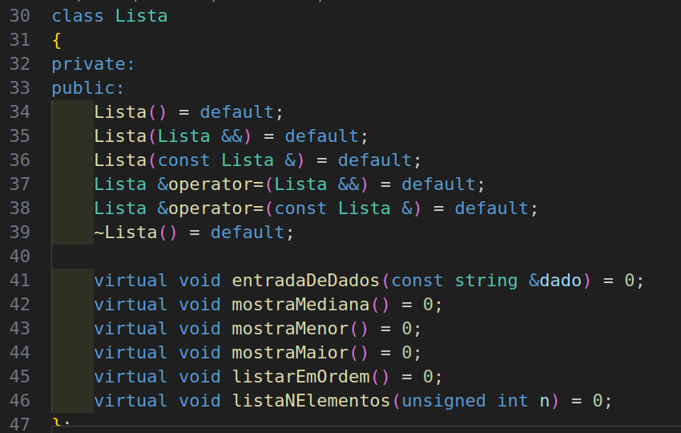
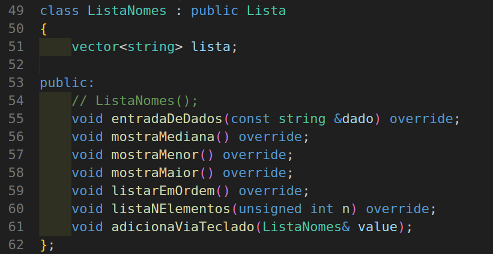
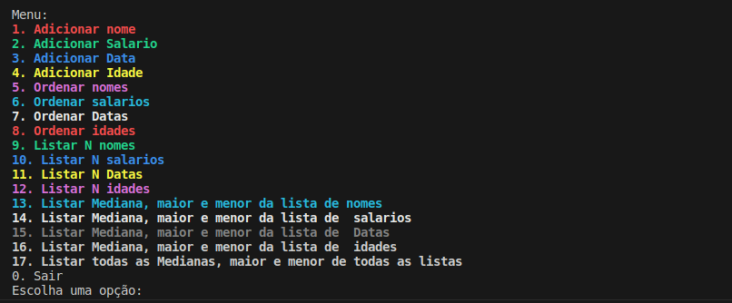
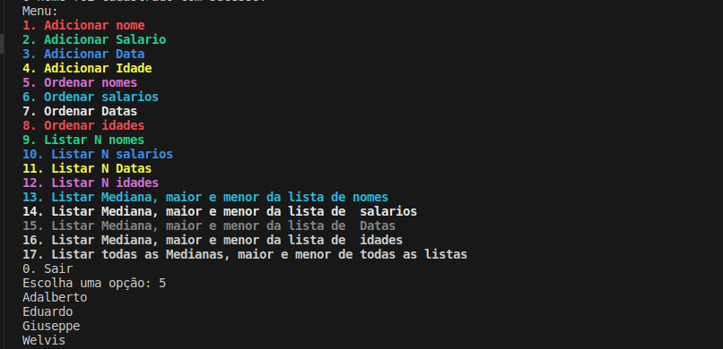
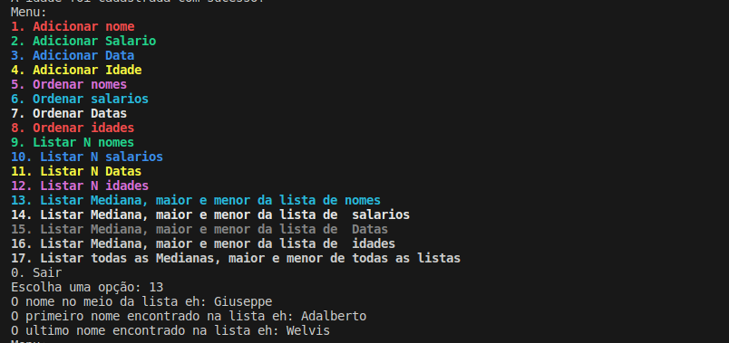

# Projeto de Avaliação - Residência TIC 18

Este projeto é parte da segunda avaliação do programa de Residência em Tecnologia da Informação e Comunicação (TIC) 18. O objetivo do projeto é transformar um código originalmente escrito em programação estruturada em um código orientado a objetos, aplicando conceitos de POO, polimorfismo, modularização e muito mais.

## Classes Principais

- **Data:** Uma classe para lidar com tipos de data.
- **Lista:** Uma classe abstrata que serve como base para outras classes.
- **ListaNomes:** Uma classe derivada de `Lista` para lidar com listas de nomes.
- **ListaSalarios:** Uma classe derivada de `Lista` para lidar com listas de salários.
- **ListaDatas:** Uma classe derivada de `Lista` para lidar com listas de datas.
- **ListaIdades:** Uma classe derivada de `Lista` para lidar com listas de idades.

## Capturas de Tela

- Super Classe Lista

- Exemplo da Classe Lista Nome Derivada de Lista no arquivo .hpp . 

- Exemplo do menu rodando.

- Exemplo de ordenação dos nomes .

- Exemplo de mediana, maior e menor dos nomes .

## Contribuição

Se você deseja contribuir para este projeto, siga estas etapas:

1. Faça um fork do projeto.
2. Crie uma branch com o padrão `dev/Nome_da_Pessoa`.
3. Implemente suas alterações.
4. Envie um pull request para a branch `dev/grupo`.

